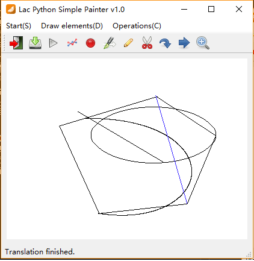

# 系统使用说明书
这是李奡程（161220062）的2019年春季的图形学大作业的系统使用说明书。如果对说明书中的描述不清楚的地方，或者代码运行错误的地方，请通过161220062@smail.nju.edu.cn联系我。
## 命令行部分
---
### 开发环境
---
python3
### 库函数依赖
---
numpy, matplotlib, opencv
### 运行
---
在./commandLine 文件夹下执行python main.py运行。
### 程序运行说明
---

命令行支持指令如下：
#### resetCanvas width height
重置画布，设置宽高，满足 100<=width, height<=1000
#### saveCanvas name
将当前画布保存为 name.bmp
#### setColor R G B
设置画笔颜色为[R,G,B],其均为8位大小
#### drawLine id x1 y1 x2 y2 algorithm
绘制编号为id的线段，起于(x1,y1)，终于(x2,y2)，可使用“DDA”或者“Bresenham”算法绘制；注意id需**没被其他图元注册过**，各坐标**需在画布范围内**
#### drawPolygon id n algorithm
#### x1 y1 x2 y2 ... xn yn
绘制编号为id的多边形，分两行输入，算法同线段，同样需注意id**未被注册**，且坐标需**在画布范围内**
#### drawEllipse id x y a b
绘制编号为id的椭圆，其圆心位于(x,y)，长短轴半径分别为a，b，需注意id**未被注册**，且椭圆上所有点坐标需**在画布范围内**
#### drawCurve id n algorithm
#### x1 y1 x2 y2 ... xn yn
绘制编号为id的曲线，具有(x1,y1)到(xn,yn)的n个控制点，可以选择曲线形状为B-spline或者Bezier，需注意id**未被注册**，且各控制点坐标需**在画布范围内**
#### translate id dx dy
平移编号为id的图元，注意id需**已经被注册过**，且平移后**不会超过画布范围**，否则会报错
#### rotate id x y r
使编号为id的图元绕(x,y)顺时针旋转r角度，注意id需**已经被注册过**，且旋转后**不会超过画布范围**，否则会报错
#### scale id x y s
使编号为id的图元据(x,y)恒等缩放s倍，注意id需**已经被注册过**，且缩放后**不会超过画布范围**，否则会报错
#### clip id x1 y1 x2 y2 algorithm
根据裁剪窗口(x1,y1)->(x2.y2)裁剪编号为id的线段，使用Cohen-Sutherland算法或者Liang-Barsky算法，注意id需**已经被注册过并且是线段**，且裁剪坐标**在画布范围内**
#### **show （新增方法）**
在命令行交互过程中展示当前画布情况

## 图形界面部分
---
### 开发环境
---
python3
### 库依赖
---
numpy, matplotlib, opencv, PyQt5
### 程序运行说明
---
进入./gui文件夹下，输入python main.py 运行。
### 交互方法
---
#### 界面说明

GUI界面窗口名为Lac Python Simple Painter v1.0，窗口界面分为4部分，最上面一栏为菜单栏，包括各种选项；下面一栏为工具栏，即各个图标的那一栏，其为菜单栏中各种操作的快捷方式；中间白色的部分是初始化的画图界面部分，实际画图即在这上面操作；最下面是状态栏，会显示当前的状况和提示信息。
#### 菜单栏介绍

菜单栏中共有四个操作，New canvas选项新建画布，Refresh选项刷新画布调整大小（当resize后出现画布缩放失衡时可以选择Refresh尝试调整），Exit退出程序，Save保存当前画布。
#### 画图栏介绍

画图栏中共有五个操作，Set color选择画笔颜色，Line绘制线段，Polygon绘制多边形，Ellipse绘制椭圆，Curve绘制曲线。
#### 操作栏介绍

操作栏中共有四个操作，Clip裁剪线段或者删除图元，Rotate旋转图元，Translate平移图元，scale缩放图元。
#### 具体操作——菜单栏
---
#### 新建画布

如图，选中后会弹出New Canvas对话框，依次选择或输入想要的宽、高并选Yes后会弹出新画布并**舍弃当前画布**。
#### 刷新
目前无特殊用途，后续开发使用。
#### 退出
直接退出窗口。
#### 保存画布

选中开始菜单栏或者工具栏中第二个图标后会弹出，输入文件名后即保存为相应的位图文件。
#### 具体操作——绘图栏
---
#### 线元绘制

选中菜单栏或者工具栏中的相应选项，开始绘制，此时canvas开始记录鼠标点击和释放事件。将下一次鼠标点击事件的坐标作为线段起始点，鼠标释放位置作为线段终止点。

#### 椭圆绘制

通过选中菜单栏中的对应选项或者单击工具栏中的相应图标开始绘制，此时canvas开始记录鼠标点击和释放事件，其将下一次鼠标点击事件和释放事件坐标圈定的矩形框作为椭圆的外切矩形，并根据其计算出椭圆参数绘制。

#### 多边形绘制

通过选中菜单栏中的对应选项或者单击工具栏中的相应图标开始绘制，此时canvas开始记录鼠标点击事件，我将每次点击的点作为多边形的顶点，并当再次选中菜单栏中的多边形选项时完成绘制，并展示画好的多边形。

在上例中，需要先点击polygon按钮，再鼠标单击选中canvas中的5个点，最后再点击polygon，完成五边形的绘制。
#### 曲线绘制

同样通过选中菜单栏中的对应选项或者单击工具栏中的相应图标开始绘制，此时会弹出窗口，可以选择曲线风格为贝塞尔曲线或者B样条曲线，选定后canvas开始记录鼠标点击事件，并且将每次点击的点记为控制顶点，最后再次点击curve按钮，完成绘制。

在上例中，我们选取了多边形的五个顶点作为贝塞尔风格曲线的控制顶点，所以总共需点击curve两次，在画布上点击5次。
#### 调整颜色

通过菜单栏或者工具栏可以选择画笔颜色，弹出颜色对话框，选择完后画笔颜色会相应发生改变。
#### 具体操作——二维变换栏
---
#### 开始前——选定

当未进行绘图操作时，画板会记录鼠标点击位置，并和存储的图元作对比，当距离小于一定值时距离最短的图元即被选中，可以进行裁剪、旋转、平移、缩放等操作。没有图元选中时，上述操作**无法进行**。
#### 裁剪&删除

此处已经选定好了黑色的那条直线，接下来进行裁剪，通过点击菜单栏或者工具栏中的相应选项开始裁剪，此时画布开始记录鼠标点击和释放事件，默认鼠标下一次点击和释放的两点圈定的矩形范围即为线段的裁剪窗口，释放之后即显示裁剪结果。

如图为裁剪后的结果。此外若选定的图元不是线段，默认直接删除。
#### 旋转

选定图元后通过选定菜单栏或者工具栏中的相应选项开始旋转图元，此处以绘制的曲线为例。旋转分为两步，第一步状态栏显示“请确定旋转中心”，等待用户鼠标单击画布确定选中中心位置。

如图，此时已单击曲线最下点作为旋转中心，这是进入第二步，状态栏显示等待用户规定旋转尺度，此时画布等待接受用户的鼠标单击事件和释放事件，通过两个事件的鼠标位置确定旋转角度大小。

此时选择曲线向右上方旋转，可以看出曲线完成了旋转。
#### 平移

选定图元后通过选定菜单栏或者工具栏中的相应选项开始平移图元，此处以绘制的椭圆为例。单击平移后，画布等待接受用户的下一次鼠标单击事件和释放事件，用两事件的坐标相对关系确定平移距离。

如图，此时单击的点为椭圆的右端点，释放的点为多边形的一个顶点，可以看到椭圆被平移到该点周围位置。
#### 缩放

选定图元后通过选定菜单栏或者工具栏中的相应选项开始平移图元，此处以多边形为例。单击缩放后，进入第一步，等待用户用鼠标单击事件规定缩放中心。缩放中心确定后，通过用户的下一次鼠标单击和释放事件确定相对于中心的缩放比例，并进行相应操作，过程类似之前旋转操作的流程。

此例中通过选择多边形左下顶点作为缩放中心进行定点缩放，效果如上。
#### 样图
